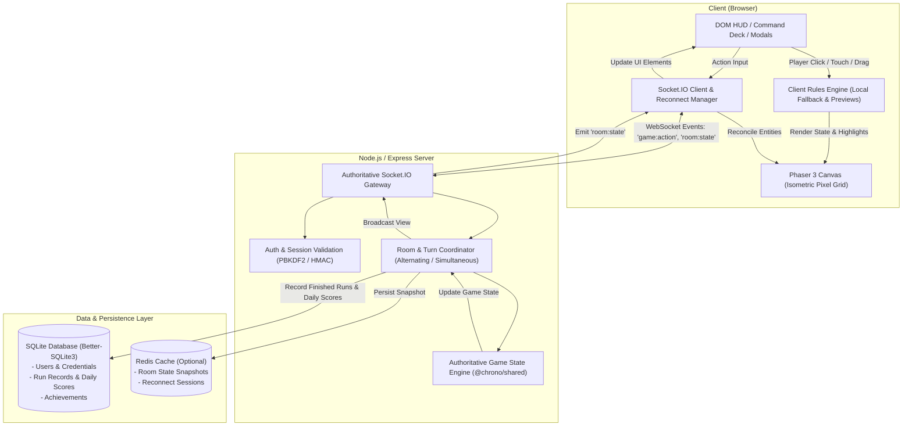
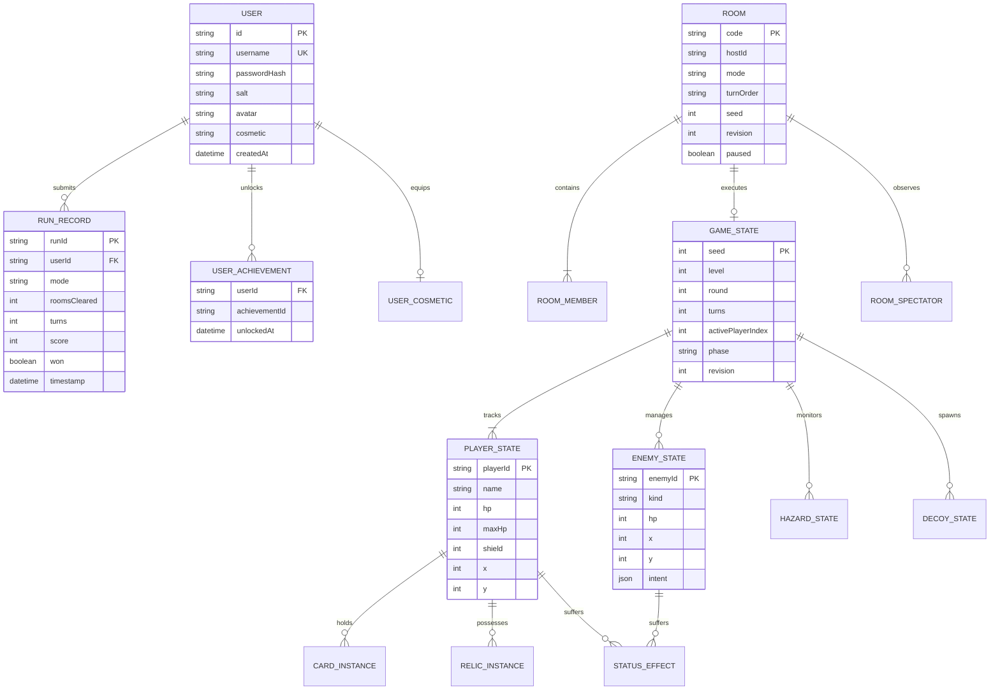

#  Chrono Card

> **A tactical card-driven dungeon crawler where your hand is your movement.**  
> Choose your path through 15 authored rooms across three distinct Acts, draft synergies, collect game-altering relics, and survive solo, with a ghost ally, on the same screen, or in real-time online co-op for up to four players.

[](https://chrono-card.onrender.com)
[](https://github.com/rishab11250/Chrono-Card)
[](https://www.typescriptlang.org/)
[](https://phaser.io/)
[](https://socket.io/)
[](https://vitest.dev/)

---

## 🔗 Links

- **Live Web App**: [https://chrono-card.onrender.com](https://chrono-card.onrender.com)
- **Source Code**: [https://github.com/rishab11250/Chrono-Card](https://github.com/rishab11250/Chrono-Card)

---

## 🎮 Game Overview

**Chrono Card** reimagines grid dungeon crawling through the lens of strict action-economy card play. You do not move with directional keys—**every step, strike, defense, and swap is governed by the cards in your hand**.

Enemies broadcast their exact offensive intents, charging strikes, and movement vectors a full round in advance. Survival demands positioning, timing, card drafting, and seamless coordination with party members.

```
                    ┌────────────────────────┐
                    │   THE THRESHOLD (01)   │
                    └───────────┬────────────┘
                                │
                   ┌────────────┴────────────┐
                   ▼                         ▼
         ┌───────────────────┐     ┌───────────────────┐
         │ Cinder Passage    │     │ The Lost Archive  │
         │ (Open Fire Lanes) │     │ (Ancient Vaults)  │
         └─────────┬─────────┘     └─────────┬─────────┘
                   └────────────┬────────────┘
                                ▼
                    ┌────────────────────────┐
                    │   CHASM CROSSING (03)  │
                    └───────────┬────────────┘
                                ▼
                    ┌────────────────────────┐
                    │  WARDEN'S LAIR (BOSS)  │
                    └────────────────────────┘
```

---

## 🕹️ Game Mechanics & Rules

### 1. The Core Loop & Action Economy

- **2 Plays Per Turn**: Every turn, an explorer has 2 base plays.
- **Movement via Cards**: `Step I`, `Step II`, `Step III`, `Phase Dash`, and `Rift Hop` dictate positioning.
- **Guaranteed Hand Balance**: Every freshly drawn hand guarantees at least one movement card and one attack card—unlucky draws cannot stall a run.
- **Free Plays & Recharges**:
  - `Redraw` (Second Chance): Discard unplayed cards and draw fresh cards for **0 plays**.
  - `Clockwork Dart` (`quickshot`): Costs **0 plays**, but triggers a 2-round shared recharge cooldown across all copies.
- **Combo Chains**:
  - Playing an **Attack card immediately after a Move card** triggers a **Combo Strike**, dealing **+1 bonus damage**!

### 2. Telegraphed Enemy Combat

Enemies plan and lock their actions at the start of the round:

- 🟥 **Red Tile Outlines**: Imminent attacks landing next round.
- 🟪 **Purple Tile Outlines**: High-threat 2-round charged strikes from Elite wardens.
- 🟡 **Gold Bomb Markers**: Bomber targeting reticles; turn into 3-round fiery embers that damage only upon entry.
- ⚪ **Dotted Move Vectors**: Paths enemies will slide along after resolving attacks.
- 🟩 **Card Hover Previews**: Hovering over cards highlights their exact legal target area and attack reach directly on the Phaser board.

### 3. Status Effects

- ☠️ **Poison**: Inflicts 1 direct damage per round for the effect's duration (ticks at turn/round transition).
- ✦ **Stun**: Incapacitates the target for 1 round, completely skipping their offensive turn and movement.

### 4. Relic System

Earned between room transitions during reward selection. Relics grant permanent run passives:

- ♥ **Iron Heart**: +2 Max HP and heals 2 HP immediately upon pickup.
- ⚡ **Swift Boots**: Begin every room with +1 bonus play on turn 1.
- ◇ **Ember Shield**: Enter every room with a protective shield active.
- ⚔ **Sharp Edge**: All attack cards deal +1 extra damage.
- ✦ **Deep Pockets**: Expand hand capacity by +1 card (draw 6 cards each round).

### 5. Progression & World Features

- **Breakable Walls (`'B'`)**: Cracked masonry blocks movement like normal walls, but breaks into open floor (`'.'`) when hit by attacks.
- **Act Mutators**: Dynamic environmental conditions that alter dungeon rules per Act:
  - `Dense Fog`: Projectile range reduced by 1 tile.
  - `Unstable Ground`: Hazard tiles inflict +1 bonus damage.
  - `Temporal Surge`: Explorers begin room 1 with 3 plays.
- **Random Events**: Encounters that appear along the journey:
  - _Shrine of Vitality_: Restores 3 HP to all explorers.
  - _Time Forge_: Upgrades a base card in your deck (`Strike` ➔ `Strike+`, `Arrow` ➔ `Arrow+`, `Step II` ➔ `Step III`, `Aegis` ➔ `Aegis+`).
  - _Curious Merchant_: Offers powerful relics in exchange for health sacrifice.
- **Scoring System**:
  $$\text{Score} = (\text{Rooms Cleared} \times 1000) - (\text{Turns} \times 10) + (\text{Flawless Rooms} \times 250) + (\text{Relics} \times 100)$$

---

## 🃏 Card Catalog

| Card               | Category     | Range | Cost | Effect                                                                           |
| :----------------- | :----------- | :---: | :--: | :------------------------------------------------------------------------------- |
| **Step I**         | Move         |   1   |  1   | Move 1 tile in any orthogonal or diagonal direction.                             |
| **Step II**        | Move         |   2   |  1   | Move up to 2 tiles in a straight cardinal line.                                  |
| **Step III**       | Move         |   3   |  1   | Upgraded sprint: move up to 3 tiles in a straight line.                          |
| **Phase Dash**     | Move         |   2   |  1   | Dash 2 tiles straight ahead; skips hazards and enemies en route.                 |
| **Rift Hop**       | Move         |   2   |  1   | Teleport to an empty floor tile up to 2 steps away, even over walls.             |
| **Swap**           | Move/Support |   3   |  1   | Switch board positions with any ally or enemy in clear view.                     |
| **Iron Edge**      | Attack       |   1   |  1   | Strike an adjacent enemy for 2 damage (deals 3 damage with Combo).               |
| **Iron Edge+**     | Attack       |   1   |  1   | Forged blade: deals 3 damage (deals 4 damage with Combo).                        |
| **Light Lance**    | Attack       |   2   |  1   | Projectile attack dealing 2 damage along a clear line of sight.                  |
| **Light Lance+**   | Attack       |   3   |  1   | Upgraded lance dealing 3 damage with extended range 3.                           |
| **Petal Storm**    | Attack       |   0   |  1   | Spin attack hitting all adjacent tiles for 2 area-of-effect damage.              |
| **Clockwork Dart** | Attack       |   2   |  0   | Free 1-damage dart; triggers a 2-round global cooldown.                          |
| **Shockwave**      | Attack       |   0   |  1   | Knock back all adjacent enemies by 1 tile and deal 1 damage.                     |
| **Chain Spark**    | Attack       |   2   |  1   | Shock an enemy for 1 damage; arcs to all adjacent enemies for 1 damage.          |
| **Pierce**         | Attack       |   3   |  1   | Penetrating beam dealing 2 damage to all enemies in a straight line.             |
| **Toxic Blade**    | Attack       |   1   |  1   | Strike adjacent enemy for 1 damage and apply 3 rounds of Poison.                 |
| **Aegis**          | Support      |   0   |  1   | Gain a protective shield that nullifies the next instance of damage.             |
| **Aegis+**         | Support      |   0   |  1   | Reinforced ward: grants 2 stacks of damage-absorbing shield.                     |
| **Chrono Snare**   | Support      |   2   |  1   | Target an enemy up to 2 tiles away to poison them for 3 rounds.                  |
| **Time Rewind**    | Support      |   0   |  1   | Cleanse 1 negative status effect and refund 1 play this turn (2 round cooldown). |
| **Decoy Dummy**    | Support      |   2   |  1   | Deploy a 2 HP clockwork decoy to draw enemy targeting away from players.         |
| **Redraw**         | Support      |   0   |  0   | Free redraw: discards remaining hand and draws a fresh selection.                |
| **Hunter's Mark**  | Support      |  10   |  1   | Mark yourself or an ally: their next attack deals +1 bonus damage.               |
| **Lend / Taunt**   | Co-op        |   3   |  1   | Multiplayer cards: grant an action play to an ally or redirect enemy intent.     |

---

## 👾 Enemy Archetypes & AI Behavior

All enemies feature deterministic, predictable behaviors allowing tactical counter-play:

| Enemy             | HP  | DMG | Threat | Behavior & Tactical Strategy                                                                             |
| :---------------- | :-: | :-: | :----: | :------------------------------------------------------------------------------------------------------- |
| **Chaser**        |  2  |  1  |   1    | Relentless tracker. Walks directly toward the closest explorer and strikes adjacent tiles.               |
| **Sentinel**      |  2  |  2  |   1    | Static laser turret. Locks onto straight cardinal sightlines and fires penetrating shots.                |
| **Seeker**        |  2  |  1  |   2    | Flying wraith. Ignores floor obstacles and floats over hazards to pursue the lowest-HP explorer.         |
| **Bomber**        |  2  |  0  |   1    | Saboteur. Drops timed embers on player escape paths and flees from close combat.                         |
| **Healer**        |  3  |  0  |   2    | Combat medic. Keeps distance and restores 1 HP to the lowest wounded ally within 3 tiles.                |
| **Shield Bearer** |  4  |  1  |   2    | Armored bulwark. Absorbs heavy damage and casts protective shields on adjacent allies.                   |
| **Teleporter**    |  3  |  2  |   3    | Eldritch stalker. Blinks to random floor positions every 2 rounds, striking adjacent tiles upon arrival. |
| **Summoner**      |  3  |  0  |   3    | Necrotic conduit. Summons minions into battle every 3 rounds; retreats when wounded.                     |
| **Warden (Boss)** |  6  |  2  |   4    | Act boss. Employs 2-round charging sweeps, sweeps large arcs, and tests full deck mastery.               |

---

## 🕹️ Game Modes

1. **Solo Adventure**: Tactical single-player campaign across 15 levels. Automatically saves local state in `localStorage`.
2. **Couch Co-op (Same Device)**: Play cooperatively on a single screen with shared alternating turns and separate hands.
3. **Ghost Ally Replay**: Save successful past runs as "Ghost" allies. Play alongside the automated ghost that replays your previous actions step-by-step.
4. **Online Multiplayer (2–4 Players)**:
   - **Alternating Turns**: Classic turn-order strategy where teammates pass the initiative.
   - **Simultaneous Turns**: Fast-paced tactical mode where all players submit their card sequences in parallel, resolving dynamically in party order.
   - **Private Rooms & Spectator Links**: 6-character room codes (`ABC123`) with one-click invite links and spectator mode.
   - **90-Second Disconnect Grace**: Flaky mobile or browser refreshes can seamlessly rejoin the live room without forfeiting.
   - **Personalized Indicators**: Overhead `▼ YOU` indicator and golden turn rings ensure you never lose track of your explorer.
5. **Daily Challenge**: A synchronized global run with a shared UTC seed. Players compete on the leaderboard ranked by lowest turn count and fastest elapsed time.

---

## 🗺️ Dungeon Progression: All 15 Authored Rooms

Chrono Card features a non-linear campaign across three distinct Acts. Each Act features branching forks where players choose between high-risk reward rooms or open tactical lanes, converging before the Act Warden:

### Act I — Mosslit Ruins (Ancient Stone & Overgrowth)

- **01. The Threshold**: _Every escape begins with a single step._ The tutorial ruins introduce straight-line movement, obstacles, and basic Chaser/Sentinel placements.
- **02A. Cinder Passage (Branch A)**: _The floor remembers the fire._ Open stone lanes flanked by smoldering hazard spikes.
- **02B. The Lost Archive (Branch B)**: _Some things were never meant to be found._ Tight pillars and hidden corners guarded by sentinels.
- **03. Chasm Steps**: _Narrow ledges above the abyss._ Cramped ledges requiring precise maneuvering to bypass hazards.
- **04. The Iron Gate (Act I Boss)**: _The first warden bars the forward path._ Face the Iron Warden Elite in an arena of hazards.

### Act II — Sunken Vaults (Aquatic Catacombs · Mutator: Dense Fog)

> **Environmental Mutator — Dense Fog**: Thick mist envelops the vaults, reducing all projectile and lance ranges by 1 tile.

- **05. Flooded Gallery**: _Stone bridges connect the sunken vaults._ Elevated pathways over flooded waterways.
- **06A. The Long Corridor (Branch A)**: _Flanked by ancient walls and watching eyes._ Long straightaways offering unobstructed lines of sight.
- **06B. Clockwork Hollow (Branch B)**: _Learn the pattern. Break the cycle._ Enclosed chamber packed with ancient clockwork machinery.
- **07. The Grand Colosseum**: _Open ground offers no shelter._ Wide-open battleground surrounded by multiple enemy spawns.
- **08. Vault of the Chrono-Smith (Act II Boss)**: _The master builder guards the second threshold._ Symmetrical arena where the Chrono-Smith summons defenses.

### Act III — Fractured Time (Eldritch Void · Mutator: Temporal Surge)

> **Environmental Mutator — Temporal Surge**: Raw temporal energy infuses explorers with +1 starting play (3 plays total) on turn 1 of every room.

- **09. Fractured Causeway**: _Reality frays into the dark expanse._ Floating platforms over the cosmic void.
- **10A. The Whispering Narthex (Branch A)**: _Echoes of unlived futures reverberate._ Vast hall with multiple paths between towering pillars.
- **10B. Heart of the Hourglass (Branch B)**: _The sands rush ever faster toward zero._ Tight concentric arena where enemies converge toward the center.
- **11. The Penultimate Gate**: _Beyond this door lies the heart of the cycle._ A punishing gauntlet of alternating spike hazards and elite defenders.
- **12. The Shattered Sanctum (Final Boss)**: _Time bends. The final warden waits._ The ultimate confrontation with the Chrono Warden to escape the loop.

---

## 👻 Ghost Ally: Autonomous AI Companion

Chrono Card lets you turn your own play history into an automated co-op partner:

1. **Record**: Complete any solo expedition to record your exact step-by-step card sequences, tile movements, and target placements.
2. **Save**: Archive your recording as a named Ghost Ally (stored in browser `localStorage`).
3. **Summon**: Launch **Ghost Ally Co-op** mode. Your ghost companion spawns alongside you with a spectral cyan aura (`0x78e6ff`).
4. **Autonomous Execution**: On the ghost's turn, it faithfully replays your recorded tactical choices—striking enemies, holding chokepoints, and picking optimal room routes while you execute your own hand in real-time.

---

## 🏆 Achievements & Explorer Wardrobe

### Unlockable Achievements

- 🏆 **Chrono Rush**: Clear any dungeon room in under 10 turns.
- 🏆 **Untouchable**: Complete an entire expedition without suffering a single hit (full party at maximum HP).
- 🏆 **Strength in Numbers**: Guide a full multiplayer party through the campaign to the final boss without losing a single explorer.
- 🏆 **Time Keeper**: Complete 3 Daily Challenges to claim a spot among the master chronomancers.

### Explorer Wardrobe (Cosmetic Skins)

Customize your pixel-art explorer sprite with unlockable class gear:

- 🪖 **Explorer** (Default): Classic leather trench coat, explorer cap, and field equipment.
- 🔮 **Void Voyager**: Lavender tunic with spectral violet aura (`0xcc99ff`), awarded for mastering spatial hops.
- ☀️ **Solar Strider**: Radiant gilded golden plating (`0xffd275`), unlocked through flawless dungeon clears.
- ⚡ **Chrono Master**: Electric cyan robes (`0x78e6ff`), worn by those who have shattered the final temporal loop.

---

## 🔒 Network Authority, Security & Reconnect Architecture

Chrono Card uses an authoritative client-server architecture designed for fair, cheat-proof multiplayer:

- **Server-Authoritative Game Engine**: The client is purely a view and intent generator. Moves are sent as `{ action, revision }` pairs. The server executes pure immutable engine evaluations and broadcasts authoritative state diffs.
- **Strict Zod Schema Validation**: Every WebSocket packet and HTTP payload is verified at runtime against rigorous Zod schemas with bounded string lengths, integer constraints, and discriminated action unions.
- **90-Second Disconnect Grace**: Flaky mobile networks or accidental browser tabs do not ruin a run. The server holds the disconnected player's slot for 90 seconds while teammates see a live countdown.
- **Cryptographic Session Tokens**: Reconnection uses a 32-byte cryptographic token (`crypto.randomBytes(32).toString('hex')`) verified via timing-safe buffer comparisons (`crypto.timingSafeEqual`) to prevent session hijacking.
- **Anti-Cheat Run Auditing**: Solo runs submitted to the global leaderboard without an active server session require verified turn-count sanity checks ($T \ge 15$), and daily challenge records require authoritative server verification.
- **Personalized Screen Pointer**: In co-op, each client renders an overhead `▼ YOU` indicator strictly over their own explorer, while an animated golden ring marks whichever teammate currently has the floor.

---

## 💬 Live Co-op Emotes & Quick Chat

Coordinate tactical maneuvers in real-time without taking your hands off the deck:

- **Lobby & In-Game Emote Bar**: Instantly broadcast quick tactical alerts to all connected players:
  - 🟢 **"Ready!"** — Signal readiness to start or confirm turn submission.
  - ⚠️ **"Watch out!"** — Alert teammates to incoming telegraphed hazards or charging strikes.
  - ⭐ **"Nice one!"** — Celebrate a boss defeat, combo strike, or clutch phase dash.
  - 🛡️ **"Need backup!"** — Request a player swap, shield, or bonus play lend.

---

## 🏛️ System Architecture & Data Flow



---

## 🗄️ Entity Relationship Diagram (ERD)



---

## 💻 Tech Stack

### Frontend Client

- **Framework**: Vanilla TypeScript 5.8 with modern ESM components
- **Renderer**: [Phaser 3.88](https://phaser.io/) (Canvas / WebGL pixel-art rendering engine)
- **Pixel Art**: Hand-crafted 24x24 / 32x32 retro sprites and SVG iconography
- **Styling**: Pure responsive CSS3 with handheld game console aesthetics (VT323 & Press Start 2P fonts)
- **Audio**: Synthesized Web Audio API sound effects (`beep`) with retro waveforms
- **Accessibility**: Screen-reader accessible virtual navigation grid and ARIA live regions

### Backend Server

- **Runtime**: Node.js 22.13+
- **HTTP Framework**: [Express 4](https://expressjs.com/) with strict CORS, helmet headers, and compression
- **Realtime Multiplayer**: [Socket.IO 4.8](https://socket.io/) with room namespaces and binary transports
- **Validation**: [Zod](https://zod.dev/) runtime schema validation for every incoming payload and socket packet
- **Cryptography**: Native Node.js `crypto` with `timingSafeEqual`, PBKDF2 with SHA-512, and UUID v4

### Database & Persistence

- **SQL Database**: [Better-SQLite3](https://github.com/WiseLibs/better-sqlite3) with WAL mode enabled
- **Cache / Reconnect Snapshots**: [ioredis](https://github.com/redis/ioredis) (optional cluster-safe snapshot store)
- **Client Storage**: `localStorage` (solo saves, settings, skins) and `sessionStorage` (network tokens)

### Shared Core (`@chrono/shared`)

- Pure, deterministic, zero-dependency game rules engine compiled to TypeScript and ESM.
- Seeded Linear Congruential Generator (LCG) RNG for 100% deterministic runs and replays.

### Tooling & Quality Assurance

- **Package Manager**: `pnpm` / `npm`
- **Bundler**: [Vite 6](https://vite.dev/)
- **Unit & Integration Testing**: [Vitest 4](https://vitest.dev/) (17 test suites, 130+ unit tests)
- **End-to-End Testing**: [Playwright 1.50](https://playwright.dev/) with automated browser journeys
- **Linter & Formatter**: ESLint 9 & Prettier

---

## 📁 Folder Structure

```
Chrono-Card/
├── .github/
│   └── workflows/
│       └── ci.yml               # Automated GitHub Actions CI workflow (lint, test, build)
├── docs/
│   ├── deployment.md            # Production deployment instructions (Render, Vercel, Docker)
│   ├── progression.md           # Level authoring & progression mechanics specifications
│   ├── repo-audit.md            # Security, validation, and performance audits
│   └── rules-and-completion.md  # Detailed rule edge-case documentation
├── packages/
│   ├── client/                  # Frontend Browser Application
│   │   ├── index.html           # HTML template
│   │   ├── public/              # Static assets & retro TTF fonts
│   │   └── src/
│   │       ├── auth.ts          # Authentication client & profile management
│   │       ├── board.ts         # Phaser 3 Dungeon scene & sprite reconciler
│   │       ├── icons.ts         # SVG glyphs and pixel art references
│   │       ├── main.ts          # Core UI controller, modals, and input bindings
│   │       ├── net.ts           # Socket.IO client connection & reconnect loop
│   │       ├── phone.css        # Mobile viewport adaptations
│   │       ├── pixel-art.ts     # Procedural pixel sprites and palette lookups
│   │       ├── saved-state.ts   # Local game persistence and ghost recordings
│   │       └── style.css        # Main retro pixel aesthetic stylesheet
│   ├── server/                  # Authoritative Backend Server
│   │   └── src/
│   │       ├── app.ts           # Express server, Socket.IO gateway, room logic
│   │       ├── auth.ts          # User registration, PBKDF2 hashing, JWT sessions
│   │       ├── index.ts         # Process entry point
│   │       └── persistence.ts   # SQLite & Redis storage adapters
│   └── shared/                  # Isomorphic Game Rules Engine
│       └── src/
│           ├── cards.json       # Authored card definitions and metadata
│           ├── enemies.json     # Enemy archetypes, HP, DMG, and threat values
│           ├── enemy-ai.ts      # Smart enemy pathfinding, flanking, and retreat logic
│           ├── engine.ts        # Pure functional game state evaluator & target legality
│           ├── events.json      # Random inter-room event definitions
│           ├── levels.json      # 15 authored rooms across 3 Acts
│           ├── mutators.json    # Environmental Act mutators
│           ├── relics.json      # Passive relic catalog
│           ├── types.ts         # Central TypeScript interfaces, types, and DTOs
│           └── world.ts         # Scoring formulas, breakable walls, and event resolvers
├── tests/                       # Automated Test Suites (Vitest & Playwright)
│   ├── browser/                 # Playwright E2E browser tests
│   ├── cards-combos-upgrades.test.ts
│   ├── difficulty.test.ts
│   ├── drafting.test.ts
│   ├── enemy-ai.test.ts
│   ├── engine.test.ts
│   ├── mutators-events.test.ts
│   ├── persistence.test.ts
│   ├── playthrough.test.ts      # Automated bot completing full 15-room campaigns
│   └── server.test.ts           # Real multiplayer socket integration tests
├── compose.yaml                 # Docker Compose multi-container configuration
├── Dockerfile                   # Multi-stage production container build
├── package.json                 # Monorepo root workspace configuration
└── render.yaml                  # Native Render Blueprint configuration
```

---

## 🛠️ Setup & Installation

### Prerequisites

- **Node.js**: `v22.13.0` or higher
- **Package Manager**: `pnpm` (recommended) or `npm`
- **Docker** (optional, for containerized deployment)

### 1. Clone & Install

```bash
git clone https://github.com/rishab11250/Chrono-Card.git
cd Chrono-Card

# Install dependencies across all workspace packages
pnpm install
```

### 2. Configure Environment Variables

Create a `.env` file in the root directory:

```env
PORT=3001
AUTH_SECRET=super_secret_signing_key_at_least_32_characters_long_12345
CLIENT_ORIGIN=http://localhost:5173,http://localhost:3001
TRUST_PROXY_HOPS=0

# Optional: Redis connection (falls back to memory if omitted)
# REDIS_URL=redis://localhost:6379

# Storage location for SQLite database
DATA_DIR=.
```

### 3. Run in Development Mode

Run the backend server and frontend development server concurrently:

```bash
npm run dev
```

- **Frontend Client**: `http://localhost:5173`
- **Backend Server**: `http://localhost:3001`

_(Vite automatically proxies `/api` and Socket.IO `/socket.io` to port 3001.)_

---

## 🧪 Testing & Verification

The codebase maintains full test coverage across the rules engine, network layer, and browser UI:

```bash
# 1. Typecheck the entire monorepo
npm run typecheck:all

# 2. Lint all packages
npm run lint

# 3. Verify code style
npm run format:check

# 4. Run all unit & integration test suites
npm test

# 5. Run end-to-end browser tests (Playwright)
npm run test:e2e
```

---

## 🐳 Docker Deployment

Run the complete production stack (Node.js app + Redis) via Docker Compose:

```bash
# Build and run the containers in background
docker compose up --build -d

# Check service logs
docker compose logs -f
```

The game will be live at `http://localhost:3001`.

---

## ⌨️ Controls & Accessibility

- **`1` – `5`**: Quick-select corresponding card in hand.
- **`E`**: End turn.
- **`Esc`**: Cancel current card selection.
- **`?`**: Toggle rules & instructions manual.
- **Arrow Keys + `Enter`**: Focus and select tiles on the accessible board grid.
- **Drag and Drop**: Grab cards and drop them directly onto valid tiles on the Phaser board.
- **Screen Reader Mode**: Every board tile has descriptive ARIA labels announcing tile coordinates, hazards, enemy telegraphs, and target validity in real time.
